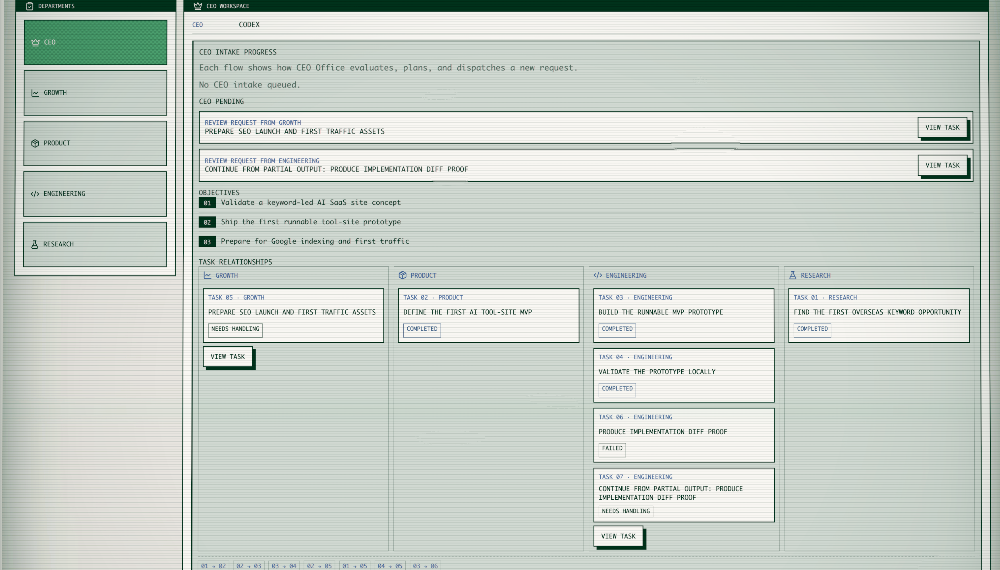
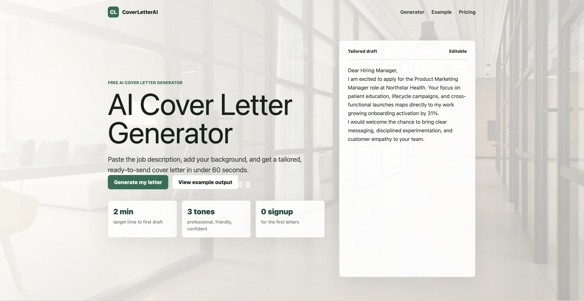

# auto-crop

auto-crop is an open-source local agent-company runtime.

It helps a founder run a "zero-person company" from their own computer: create a company, select a local agent such as Claude Code or Codex as the CEO, write a founder vision, and let auto-crop turn that vision into objectives, departments, tasks, proof, reviews, and follow-up work.

The project currently includes a local CLI runtime, a React dashboard, a SQLite-backed server, built-in Claude Code and Codex adapters, and a scheduler that coordinates agent work with proof collection, review, recovery, and a kill switch.

## What It Looks Like

auto-crop gives you a local control panel for running an agent company. Departments, tasks, proof, reviews, and recovery stay visible in one dashboard.



The output can be a real working artifact. In this example, a founder vision was turned into a runnable AI cover letter generator website.



## Quick Start

1. Clone the repository:

```bash
git clone <repo-url>
cd auto-crop
```

2. Install dependencies:

```bash
pnpm install
```

3. Run tests and type checks:

```bash
pnpm test
pnpm typecheck
```

4. Start the local auto-crop runtime:

```bash
AUTO_CROP_PORT=8787 pnpm --filter @auto-crop/cli start
```

5. In another terminal, start the dashboard:

```bash
VITE_AUTO_CROP_API_URL=http://127.0.0.1:8787 pnpm --filter @auto-crop/dashboard dev
```

6. Open the dashboard URL printed by Vite, usually:

```text
http://127.0.0.1:5173/
```

## Environment Requirements

Required:

- Node.js 24 or newer.
- pnpm 11 or newer.
- Git.

Recommended package manager version:

```text
pnpm 11.9.0
```

The project uses Node's built-in `node:sqlite` module, so Node.js 24+ is required. On Node 24, `node:sqlite` may print an experimental warning during local runs and tests.

Python is not required for the current project runtime.

Optional:

- Claude Code, if you want to use Claude Code as a local CEO or worker agent.
- Codex CLI, if you want to use Codex as a local CEO or worker agent.
- Playwright Chromium, if you want to run dashboard E2E tests.

Main dependency versions currently used by the project include:

- TypeScript `^5.9.2`
- Vitest `^3.2.4`
- tsx `^4.23.12`
- React `^19.1.1`
- Vite `^7.1.3`
- Playwright `^1.62.1`
- Zod `^4.1.5`

## Usage

Start auto-crop from the repository you want it to operate on:

```bash
AUTO_CROP_PORT=8787 pnpm --filter @auto-crop/cli start
```

The CLI will:

- Create local runtime state under `.auto-crop/`.
- Create `.auto-crop/state.sqlite`.
- Start the local API server.
- Detect available Claude Code and Codex adapters.
- Print the local dashboard/API URL.

During development, run the dashboard separately:

```bash
VITE_AUTO_CROP_API_URL=http://127.0.0.1:8787 pnpm --filter @auto-crop/dashboard dev
```

In the dashboard:

1. Enter a company name.
2. Select a detected CEO agent.
3. Write the founder vision.
4. Choose a permission mode.
5. Create the company.
6. Review generated departments, tasks, proof, approvals, and live events.

## Development Commands

Run all tests:

```bash
pnpm test
```

Run type checks:

```bash
pnpm typecheck
```

Run the mock smoke test:

```bash
pnpm smoke:mock
```

Run a real-agent smoke test:

```bash
pnpm smoke:real-agent
```

Use Codex for the real-agent smoke test:

```bash
AUTO_CROP_REAL_AGENT=codex pnpm smoke:real-agent
```

Run dashboard tests:

```bash
pnpm --filter @auto-crop/dashboard test
pnpm --filter @auto-crop/dashboard typecheck
```

Install Playwright Chromium and run E2E tests:

```bash
pnpm --filter @auto-crop/dashboard exec playwright install chromium
pnpm --filter @auto-crop/dashboard e2e
```

## Local Runtime Files

auto-crop stores local state inside the workspace it operates on:

```text
.auto-crop/
  state.sqlite
  companies/<companyId>/
    departments/<departmentId>/Memory.md
    tasks/
    artifacts/
    proof/
    reviews/
    logs/
  workspaces/<taskId>/
```

Do not run auto-crop against a repository unless you are comfortable with it creating and modifying files under that workspace.

## Credits

This project is made by MAH.

MAH: [https://mah.bot/](https://mah.bot/)
